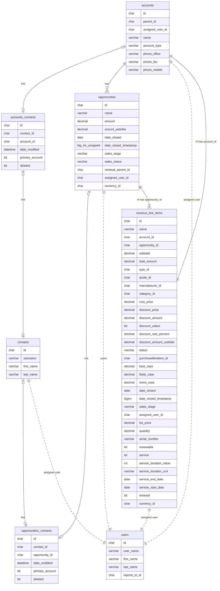

```mermaid
erDiagram

accounts |o--o| accounts_contacts : link
accounts_contacts |o--o| contacts : link
contacts |o--o| opportunities_contacts : link
accounts ||--o{ opportunities : has
opportunities |o--o| opportunities_contacts : link
opportunities ||..|| users : "users"
opportunities ||--|{ revenue_line_items : "rli has opportunity_id"
revenue_line_items ||--|| accounts : "rli has account_id"
revenue_line_items ||..|| users : "assigned user"
contacts ||..|| users : "assigned user"
accounts ||..|| users : "assigned user"

accounts {

char id

char parent_id

char assigned_user_id

varchar name

varchar account_type

varchar phone_office

varchar phone_fax

varchar phone_mobile

}

  

accounts_contacts {

char id

char contact_id

char account_id

datetime date_modified

bit primary_account

bit deleted

}

  

opportunities_contacts {

char id

char contact_id

char opportunity_id

datetime date_modified

bit primary_account

bit deleted

}

  

contacts {

char id

varchar salutation

varchar first_name

varchar last_name

  

}

  

opportunities {

char id

varchar name

decimal amount

decimal acount_usdollar

date date_closed

big_int_unsigned date_closed_timestamp

varchar sales_stage

varchar sales_status

char renewal_parent_id

char assigned_user_id

char currency_id

}

  

revenue_line_items {

char id

varchar name

char account_id

char opportunity_id

decimal subtotal

decimal total_amount

char type_id

char quote_id

char manufacturer_id

char category_id

decimal cost_price

decimal discount_price

decimal discount_amount

bit discount_select

decimal discount_rate_percent

decimal discount_amount_usdollar

varchar status

char purchasedlineitem_id

decimal best_case

decimal likely_case

decimal worst_case

date date_closed

bigint date_closed_timestamp

varchar sales_stage

char assigned_user_id

decimal list_price

decimal quantity

varchar serial_number

bit renewable

bit service

int service_duration_value

varchar service_duration_unit

date service_end_date

date service_start_date

bit renewal

char currency_id

}

  

users {

char id

varchar user_name

varchar first_name

varchar last_name

char reports_to_id

}
```
